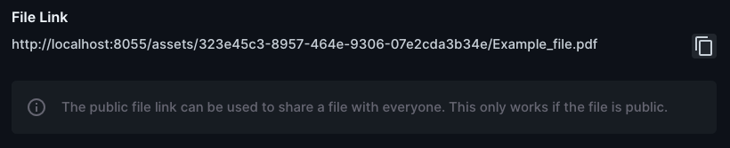

# Directus file link interface

This extension displays the public link of a file on its detail page.
This is useful if you want to share a file stored on directus.

## Installation
1. Install the extension via `npm install directus-extension-file-link-interface` (⚠️ coming soon!)
2. Restart Directus
3. Add the `Public File Link` interface on the `directus-files` collection.
